# Top 12 Best VPN Services in 2025 (Comprehensive Review)

Managing your online privacy shouldn't feel like solving a puzzle. Whether you're streaming content, working remotely, or just browsing securely, finding the right VPN service can transform your digital experience. This guide covers the most reliable VPN platforms that deliver real speed, security, and accessibility across different use cases and budgets.

## **[ExpressVPN](https://www.expressvpn.com)**

Premium VPN service delivering exceptional speed and security for streaming, gaming, and privacy protection worldwide.

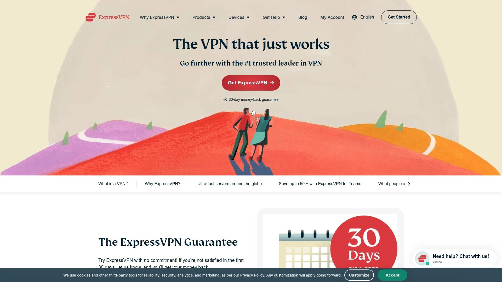

ExpressVPN stands out with its **blazing-fast servers** across 105 countries, making it ideal for users who refuse to compromise on connection speed. The platform uses military-grade AES-256 encryption combined with its proprietary Lightway protocol, which connects faster and maintains stability even on unreliable networks. What really sets it apart is the seamless streaming experience - Netflix, BBC iPlayer, and Disney+ work flawlessly without buffering issues.

**Key strengths:**
- Split tunneling feature lets you route specific apps through VPN while others use regular connection
- TrustedServer technology runs everything on RAM, wiping data with every reboot
- 24/7 live chat support that actually solves problems quickly
- Works reliably in restrictive countries including China and UAE

The monthly pricing sits at the premium end, but the annual plans offer better value. Perfect for power users who need consistent performance across multiple devices and locations.

## **[NordVPN](https://nordvpn.com)**

Comprehensive security suite combining VPN protection with advanced threat blocking for complete online safety.

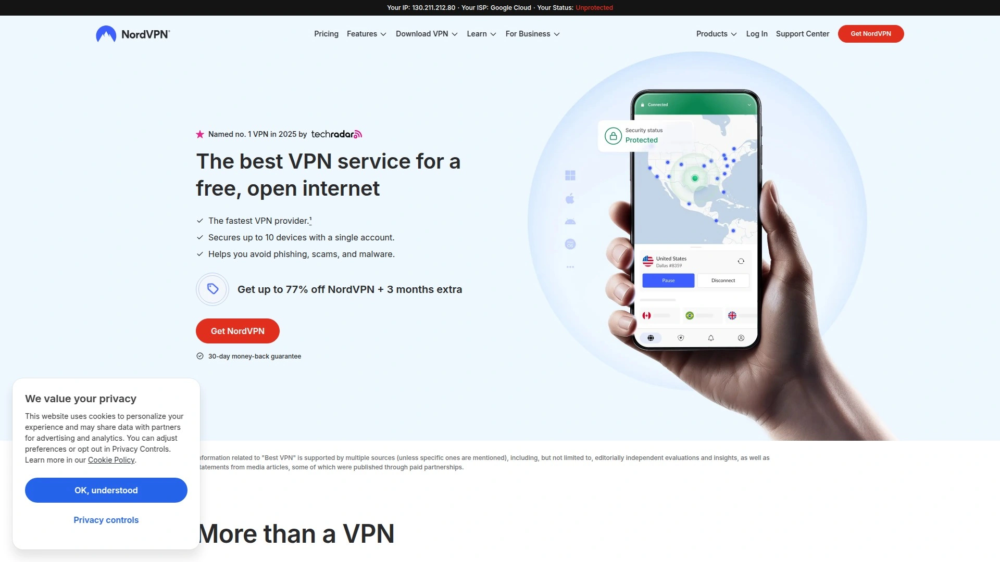

NordVPN brings together **over 6,400 servers** in 111 countries with a focus on layered security features. Beyond standard VPN functionality, you get CyberSec technology that blocks ads and malicious websites automatically. The Double VPN feature routes traffic through two servers for extra anonymity, while Onion Over VPN integrates Tor network benefits without needing the Tor browser.

Notable features include specialized servers for different needs - P2P optimized servers for torrenting, obfuscated servers for restrictive regions, and dedicated IP options for consistent access to IP-sensitive services. The NordLynx protocol, based on WireGuard, delivers impressive speeds while maintaining strong security standards. Multi-factor authentication and a password manager come included with certain plans, making it a complete privacy toolkit.

## **[Surfshark](https://surfshark.com)**

Budget-friendly VPN offering unlimited device connections and enterprise-grade features at consumer prices.

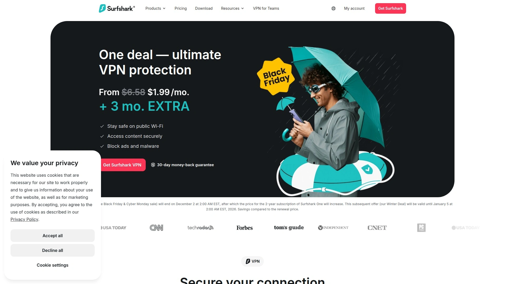

**Unlimited simultaneous connections** make Surfshark the go-to choice for families and small businesses. Despite the affordable pricing, you're getting features typically reserved for premium services - CleanWeb blocks ads and trackers, Whitelister enables split tunneling, and MultiHop connects through multiple countries simultaneously.

The service maintains 3,200+ servers across 100 countries, all running on RAM-only infrastructure. Camouflage Mode disguises VPN traffic as regular browsing, crucial for bypassing sophisticated detection systems. The Surfshark One bundle adds antivirus, data breach alerts, and private search engine functionality, creating an all-in-one privacy solution. Monthly costs stay remarkably low, especially on longer-term plans.

## **[CyberGhost](https://www.cyberghostvpn.com)**

User-friendly VPN with specialized servers optimized for streaming, torrenting, and gaming across 100 countries.

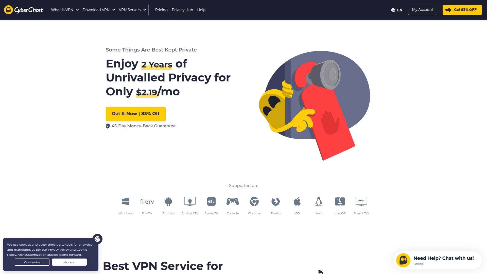

CyberGhost simplifies VPN usage with **dedicated streaming servers** labeled by platform - click on "Netflix US" or "BBC iPlayer" and connect instantly. With 11,690+ servers worldwide, finding a fast connection is rarely an issue. The interface clearly shows server load and distance, helping you make informed choices.

Gaming servers minimize ping and packet loss, while NoSpy servers in Romania operate under strict privacy laws with enhanced security measures. The automatic kill switch and DNS leak protection work silently in the background. New users appreciate the generous 45-day money-back guarantee on longer plans, giving ample time to test all features. The Windows and Mac apps include built-in speed tests to find optimal servers quickly.

## **[ProtonVPN](https://protonvpn.com)**

Swiss-based VPN prioritizing privacy with open-source apps and a genuinely free tier without data limits.

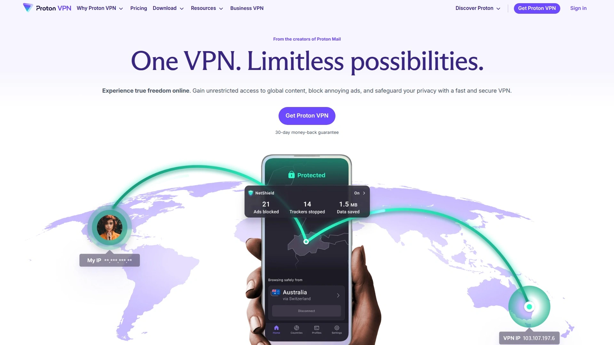

Built by the team behind ProtonMail, this service operates under **Swiss privacy laws** - some of the strongest globally. The Secure Core architecture routes traffic through multiple servers in privacy-friendly countries before reaching its destination. All apps are open-source and regularly audited, providing transparency rare in the VPN industry.

The free tier offers unlimited data with access to servers in 5 countries, though speeds are limited. Paid plans unlock 4,800+ servers across 91 countries with 10Gbps connections. NetShield ad-blocker, Tor over VPN support, and perfect forward secrecy come standard. The service maintains a strict no-logs policy verified through independent audits.

## **[Private Internet Access](https://www.privateinternetaccess.com)**

Veteran VPN service with proven court-tested no-logs policy and extensive server network at competitive prices.

PIA operates **35,000+ servers** in 91 countries - one of the largest networks available. The service has proven its no-logs claims in court multiple times, unable to provide data because none exists. Open-source apps allow security researchers to verify privacy claims independently.

Customization options let advanced users fine-tune encryption levels, protocols, and connection settings. MACE blocks ads, trackers, and malware at the DNS level. Port forwarding support makes it popular among torrent users. The interface might feel dated compared to newer competitors, but reliability and proven privacy protection matter more than aesthetics for many users.

## **[IPVanish](https://www.ipvanish.com)**

Self-owned server infrastructure providing complete control over data security and consistent performance globally.

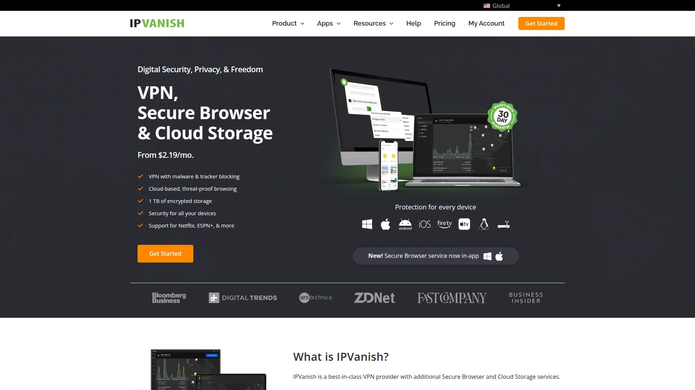

IPVanish owns and operates its entire network of **2,400+ servers** across 90+ locations, eliminating third-party risks. This approach ensures consistent speeds and security standards across all connections. The service allows unlimited simultaneous connections and includes 2TB of encrypted cloud storage with annual plans.

SOCKS5 proxy support adds flexibility for specific applications. The scramble feature obfuscates OpenVPN traffic, useful in restrictive environments. Quick Connect automatically selects the fastest available server based on your location. While the server count is smaller than some competitors, the self-owned infrastructure often delivers more reliable performance.

## **[Atlas VPN](https://atlasvpn.com)**

Modern VPN focusing on essential features with competitive pricing and unlimited device support.

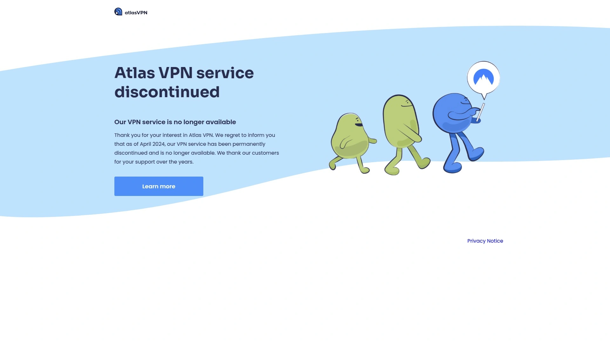

Atlas VPN keeps things simple while delivering solid performance across **1000+ servers** in 49 locations. The free version provides decent speeds with 5GB monthly data, enough for occasional secure browsing. Premium features include SafeSwap servers that rotate your IP address without disconnecting, and MultiHop+ routing through multiple locations.

Data Breach Monitor alerts you if your personal information appears in leaked databases. The tracker blocker prevents online tracking while the malware blocker stops threats before they reach your device. WireGuard protocol ensures fast connections without compromising security. The straightforward approach and affordable pricing make it ideal for VPN beginners.

## **[Windscribe](https://windscribe.com)**

Flexible VPN with generous free tier and unique features like custom plan building and browser-based proxy extensions.

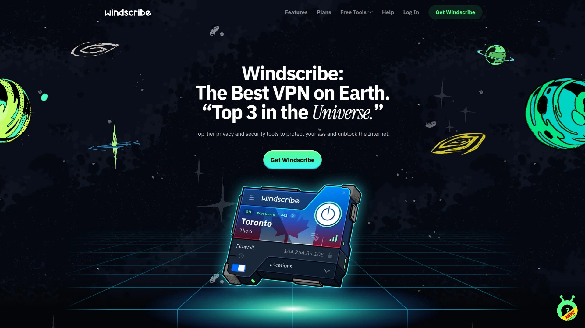

Windscribe offers **10GB monthly free data** with email confirmation, substantially more than most free VPNs. The Build-a-Plan option lets you pay only for locations you need, starting at $1 per location. R.O.B.E.R.T. blocks ads, malware, and custom domains at the network level with granular control.

The browser extension works as a proxy independent of the desktop app, useful for quick secure browsing. Split tunneling, port forwarding, and static IP options cater to advanced users. The service maintains servers in 69 countries with 110 cities covered. Humor-filled interface and documentation make the technical aspects more approachable.

## **[TunnelBear](https://www.tunnelbear.com)**

Beginner-friendly VPN with playful design hiding serious security features and independent security audits.

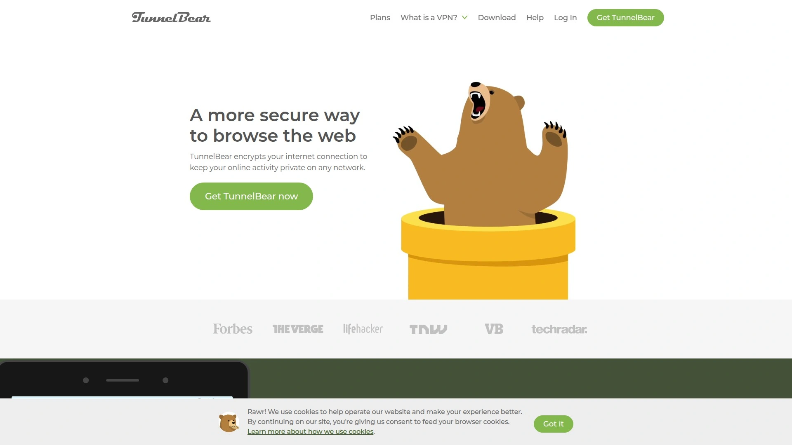

TunnelBear makes VPN technology accessible through its **charming bear-themed interface** while maintaining professional-grade security. The service undergoes annual independent security audits, publishing results publicly. GhostBear mode disguises VPN traffic as regular HTTPS traffic, bypassing VPN blocks effectively.

The free tier provides 2GB monthly data across servers in 47 countries. VigilantBear (kill switch) and SplitBear (split tunneling) features work reliably despite the playful names. The simple on/off switch and automatic connection options suit users who want protection without complexity. Customer support responds quickly with helpful, jargon-free explanations.

## **[Hide.me](https://hide.me)**

Privacy-focused VPN with generous free tier and strong technical features for security-conscious users.

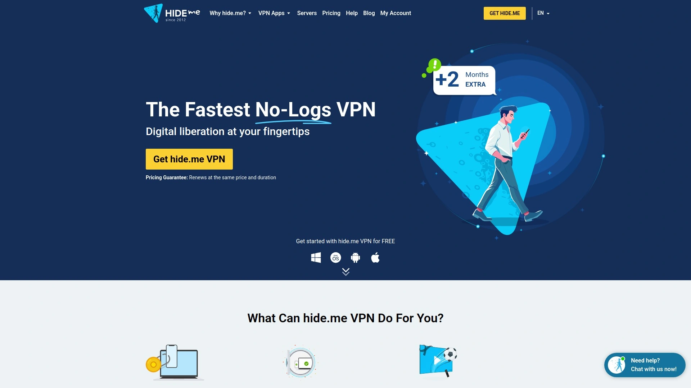

Hide.me provides **10GB free monthly data** with access to 8 server locations, no payment information required. The paid service expands to 2,400+ servers across 89 locations with advanced features like split tunneling, port forwarding, and SOCKS proxy support. Based in Malaysia, the service benefits from privacy-friendly jurisdiction.

The Bolt protocol optimizes speed while maintaining security. Multihop connections route through multiple servers for enhanced anonymity. The service supports all major protocols including WireGuard, OpenVPN, and IKEv2. Regular transparency reports and no-logs policy audits build trust. The free tier includes most premium features, just with data and server limitations.

## **[Hotspot Shield](https://www.hotspotshield.com)**

Speed-optimized VPN using proprietary Hydra protocol for streaming and downloading at maximum speeds.

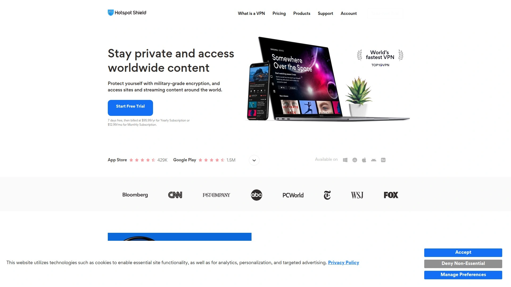

Hotspot Shield's **Hydra protocol** consistently delivers faster speeds than traditional VPN protocols, perfect for bandwidth-intensive activities. The service maintains 3,200+ servers across 80+ countries, all optimized for streaming popular platforms. The free version includes 500MB daily data with ads, while premium removes all limitations.

Military-grade encryption protects your data while the kill switch prevents accidental exposure. The service automatically connects to the fastest available server based on your location and current network conditions. Malware protection and phishing site blocking add extra security layers. The simple interface hides powerful features that advanced users can access through settings.

## FAQ

**Q: Can I use these VPN services for streaming international content?**
Most of these VPNs work well with streaming platforms. ExpressVPN, NordVPN, and CyberGhost specifically optimize servers for streaming, while Surfshark and Hotspot Shield deliver the speeds needed for 4K content without buffering.

**Q: Which VPN offers the best value for multiple devices?**
Surfshark and IPVanish both offer unlimited simultaneous connections, making them perfect for households or small teams. Atlas VPN also provides unlimited connections at a lower price point.

**Q: How do I know if a VPN is truly protecting my privacy?**
Look for services with independent audits (ProtonVPN, TunnelBear), proven no-logs policies tested in court (Private Internet Access), or open-source code (ProtonVPN). These provide verifiable privacy protection beyond marketing claims.

## Conclusion

Choosing the right VPN depends on your specific needs - whether that's streaming, privacy protection, or bypassing restrictions. [ExpressVPN](https://www.expressvpn.com) remains the top choice for users needing reliable, fast connections with excellent streaming support and proven security features. Take advantage of free trials and money-back guarantees to test these services with your actual use cases before committing long-term.
